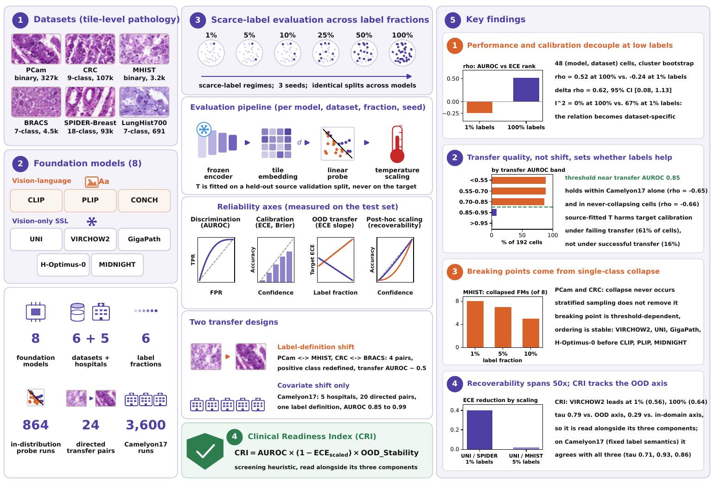

# PRISM: Pathology Reliability In Scarce-label Medicine

<p align="center">
  
</p>

<p align="center">
  
  
  
  
  
  
</p>

A benchmark for evaluating pathology foundation model **reliability** under label scarcity and domain shift.

> [THUNDER](https://github.com/MICS-Lab/thunder) tells you which FM performs best. PRISM tells you when that ranking stops predicting whether you can **trust** the model.

## Installation

```bash
# from a local checkout
pip install -e .
```

If you are reading this through an anonymised mirror, the proxy serves a
browsable copy but exposes no git endpoint, so `pip install git+<mirror-url>`
will fail. Download the repository archive first, then install from the
extracted directory as above. The package will be published to PyPI on
acceptance.

## How It Works

PRISM evaluates the reliability of pathology foundation models in data-scarce
settings rather than their accuracy alone. Eight models are evaluated across
seven histopathology datasets, six label fractions from 1% to 100%, and 24
directed transfer pairs, using a frozen-embedding linear probe protocol.
Unlike benchmarks that optimise for AUROC rankings, PRISM measures the gap
between discriminative performance and calibration reliability, which is what
determines whether a model's probabilities can be acted on clinically.

The transfer pairs come in two kinds, and that distinction turns out to matter
more than the presence of shift itself:

- **4 label-definition-shift pairs** (PCam↔MHIST, CRC↔BRACS) where the positive
  class is redefined across the pair as well as the acquisition conditions
  changing
- **20 covariate-shift pairs** from Camelyon17, where five hospitals share one
  binary task and one label definition and only the scanner, staining protocol
  and patient population differ

The protocol:

1. You extract embeddings from your model for any of the PRISM datasets
2. PRISM draws class-stratified subsets at 6 label fractions (1%, 5%, 10%, 25%, 50%, 100%) with 3 random seeds
3. At each fraction, PRISM computes AUROC, ECE, Brier score, temperature scaling, and CRI
4. Results are compared against 8 reference models (CLIP, PLIP, CONCH, VIRCHOW2, UNI, GigaPath, H-Optimus-0, MIDNIGHT)

<p align="center">
  
</p>

**Key insight:** Embeddings are extracted once. PRISM samples different label fractions automatically - no model retraining needed.

## Quick Start

```python
import numpy as np
from prism_bench import PRISMEvaluator

# 1. Extract embeddings from your model (any way you want)
train_features = your_model.encode(train_images)  # (N, D)
test_features  = your_model.encode(test_images)   # (M, D)

# 2. Evaluate
evaluator = PRISMEvaluator(results_dir='./results')
results = evaluator.evaluate(
    train_features, train_labels,
    test_features, test_labels,
    dataset='pcam',
    model_name='MyModel',
    val_features=val_features,   # needed for temperature scaling
    val_labels=val_labels,
)

# 3. Compare against 8 reference models
comparison = evaluator.compare(results, dataset='pcam', fraction=0.1)
print(comparison)
# Output: ranked table with CRI scores
```

## Foundation Models

<details>
<summary><b>List of HuggingFace URLs (click to expand)</b></summary>

| Model | Type | Size | License | HuggingFace |
|---|---|---|---|---|
| CLIP | Vision-Language | 86M | MIT | [openai/clip-vit-base-patch32](https://huggingface.co/openai/clip-vit-base-patch32) |
| PLIP | Vision-Language | 86M | Custom | [vinid/plip](https://huggingface.co/vinid/plip) |
| CONCH | Vision-Language | 86M | CC-BY-NC-ND 4.0 | [MahmoodLab/CONCH](https://huggingface.co/MahmoodLab/CONCH) |
| UNI | Vision | 307M | CC-BY-NC-ND 4.0 | [MahmoodLab/UNI](https://huggingface.co/MahmoodLab/UNI) |
| VIRCHOW2 | Vision | 632M | Apache 2.0 | [paige-ai/Virchow2](https://huggingface.co/paige-ai/Virchow2) |
| GigaPath | Vision | 1.1B | Microsoft Research License | [prov-gigapath/prov-gigapath](https://huggingface.co/prov-gigapath/prov-gigapath) |
| H-Optimus-0 | Vision | 1.1B | Apache 2.0 | [bioptimus/H-optimus-0](https://huggingface.co/bioptimus/H-optimus-0) |
| MIDNIGHT | Vision | 1.1B | MIT | [kaiko-ai/midnight](https://huggingface.co/kaiko-ai/midnight) |

</details>

## Datasets

<details>
<summary><b>List of dataset sources (click to expand)</b></summary>

| Dataset | Task | Classes | Samples | License | Source |
|---|---|---|---|---|---|
| PCam | Binary (tumor) | 2 | 327K | CC0 | [basveeling/pcam](https://github.com/basveeling/pcam) |
| CRC | Multiclass | 9 | 107K | CC-BY 4.0 | [Zenodo 1214456](https://zenodo.org/records/1214456) |
| MHIST | Binary (HP/SSA) | 2 | 3.2K | Custom (RUA) | [bmirds/MHIST](https://bmirds.github.io/MHIST/) |
| BRACS | Multiclass | 7 | 4.5K | Custom | [bracs.icar.cnr.it](https://www.bracs.icar.cnr.it/) |
| LungHist700 | Multiclass | 7 | 691 | CC-BY 4.0 | [Figshare](https://figshare.com/articles/dataset/LungHist700/24264394) |
| SPIDER-Breast | Multiclass | 18 | 92.9K | CC-BY 4.0 | [histai/SPIDER-breast](https://huggingface.co/datasets/histai/SPIDER-breast) |
| Camelyon17 | Binary (tumor), 5 hospitals | 2 | 456K | CC0 | [WILDS](https://wilds.stanford.edu/datasets/) |

Camelyon17 is used for the covariate-shift transfer study rather than as a
seventh dataset in the main in-distribution grid. We sample 20,000
label-stratified patches per hospital; split indices and the balanced re-split
index map are in `data/camelyon17/`.

</details>

## API Reference

### PRISMEvaluator

```python
from prism_bench import PRISMEvaluator
evaluator = PRISMEvaluator(results_dir=None)
```

`results_dir`: Path to PRISM reference CSVs. Required for `compare()`, optional for `evaluate()`.

### evaluate()

```python
results = evaluator.evaluate(
    train_features,   # np.ndarray (N, D) - training embeddings
    train_labels,     # np.ndarray (N,)   - integer class labels
    test_features,    # np.ndarray (M, D) - test embeddings
    test_labels,      # np.ndarray (M,)   - integer class labels
    dataset,          # str - e.g. "pcam"
    model_name,       # str - display name (default: "CustomModel")
    val_features,     # np.ndarray (V, D) - validation embeddings (optional)
    val_labels,       # np.ndarray (V,)   - validation labels (optional)
    label_fractions,  # list of floats (default: [0.01, 0.05, 0.10, 0.25, 0.50, 1.00])
    seeds,            # list of ints (default: [42, 123, 456])
)
```

Returns `pd.DataFrame` with columns: `model, dataset, fraction, seed, n_train, n_classes, auroc, f1_macro, brier, ece_fixed, ece_adaptive, temperature, ece_scaled_fixed, ece_scaled_adaptive, degeneracy_share, degenerate, forced_classes`

Works on **any dataset**.

**Validation split.** Temperature scaling requires held-out data. Without
`val_features` the temperature and both scaled-ECE columns are `NaN` and a
warning is raised; CRI cannot be computed. PRISM never falls back to fitting
the temperature on the evaluation set, since that gives an oracle estimate
rather than a deployable one.

**Label budget.** The label fraction subsamples the training split only. A
validation split used for temperature fitting is a separate budget, and at low
fractions it dominates: at 1% labels on Camelyon17 a cell uses 140 training and
3,000 validation labels. `results_v2/camelyon17_label_budget.csv` and
`results_v2/label_budget_accounting.csv` report the realised budget per cell,
and both full and proportional validation protocols are reported alongside each
other.

**Degeneracy.** At low label fractions a linear probe often assigns every test
sample to a single class. `degeneracy_share` reports the share of test samples
in the most-predicted class; near 1.0 means F1 and ECE describe a degenerate
classifier even where AUROC still looks reasonable.

### compare()

```python
comparison = evaluator.compare(
    custom_results,   # pd.DataFrame from evaluate()
    dataset,          # str - must be one of the 6 PRISM datasets
    fraction,         # float or None
)
```

Returns `pd.DataFrame` sorted by CRI, comparing your model against 8 PRISM reference models.

**Requires:** `results_dir` set + embeddings from one of the 6 main PRISM datasets.

**Does NOT work** with custom datasets outside those 6.

### Standalone metric functions

```python
from prism_bench import (compute_auroc, compute_ece, compute_brier,
                         compute_cri, compute_ood_stability,
                         temperature_scale, apply_temperature)

auroc  = compute_auroc(labels, probs)
ece_f  = compute_ece(probs, labels, n_bins=15, binning="fixed")
ece_a  = compute_ece(probs, labels, n_bins=15, binning="adaptive")
brier  = compute_brier(labels, probs)

T      = temperature_scale(val_logits, val_labels)   # held-out split only
scaled = apply_temperature(test_logits, T)

stab = compute_ood_stability(
    ood_aurocs={("pcam", "mhist"): 0.62},   # (source, target) -> OOD AUROC
    id_aurocs={"pcam": 0.98},               # source -> in-distribution AUROC
)
cri  = compute_cri(auroc, ece_scaled, stab, aggregation="multiplicative")
```

### Metrics

| Metric | Description |
|---|---|
| AUROC | Area under ROC curve (macro OvR for multiclass) |
| ECE | Expected Calibration Error, 15 bins, fixed-width or equal-mass (`binning="adaptive"`) |
| Brier | Brier score |
| ece_scaled | ECE after temperature scaling |
| temperature | Optimal temperature T, fitted on a held-out split (higher = more overconfident) |
| OOD_Stability | Mean over transfer pairs of OOD AUROC / in-distribution AUROC, clipped to 1 |
| CRI | Clinical Readiness Index = AUROC x (1 - ECE_scaled) x OOD_Stability |

`compute_cri` also accepts `arithmetic`, `geometric` and `worst_axis`
aggregations. Rankings agree across all four at Kendall tau 0.71-1.00, so the
combination rule does not drive the conclusions.

`OOD_Stability` is a ratio and therefore rewards models with less
in-distribution performance to lose. On transfer pairs where every model
performs near chance this dominates the composite; on same-task transfer it
measures what it was defined to measure. Report the three components alongside
the composite: `results_v2/cri_components.csv` and
`results_v2/camelyon17_cri_components.csv`.

## CLI Reference

```bash
# Evaluate
prism evaluate \
  --train-features X_train.npy \
  --train-labels   y_train.npy \
  --test-features  X_test.npy  \
  --test-labels    y_test.npy  \
  --val-features   X_val.npy   \
  --val-labels     y_val.npy   \
  --dataset        pcam        \
  --model-name     MyModel

# Compare against reference models
prism compare \
  --results      results.csv             \
  --results-dir  /path/to/prism/results  \
  --dataset      pcam                    \
  --fraction     0.1
```

## Supported Datasets

| Dataset | Task | Classes |
|---|---|---|
| pcam | Binary | 2 |
| mhist | Binary | 2 |
| crc | Multiclass | 9 |
| bracs | Multiclass | 7 |
| lunghist700 | Multiclass | 7 |
| spider_breast | Multiclass | 18 |
| camelyon17 | Binary, 5 hospitals | 2 |

## Repository Structure

```
prism-benchmark/
├── notebooks/
│   ├── PRISM_bootstrap_ci.ipynb
│   ├── PRISM_analysis_v2.ipynb              # Main analysis, 7 figures
│   ├── PRISM_OOD_analysis.ipynb             # OOD analysis, 3 figures
│   ├── PRISM_rebuttal_phase1.ipynb          # Corrected re-computation
│   ├── PRISM_rebuttal_phase3_peft.ipynb     # LoRA ablation
│   ├── PRISM_rebuttal_mlp_probe.ipynb       # MLP probe, in-distribution
│   ├── PRISM_rebuttal_ood_mlp.ipynb         # MLP probe, transfer
│   ├── PRISM_rebuttal_ood_c_ablation.ipynb  # Regularisation sweep, transfer
│   ├── PRISM_rebuttal_round2.ipynb          # Threshold sweep, seed variability
│   ├── PRISM_rebuttal_propval.ipynb         # Proportional label budget
│   ├── PRISM_camelyon17_extract.ipynb       # Camelyon17 embeddings (GPU)
│   ├── PRISM_camelyon17_transfer.ipynb      # 20 hospital pairs (CPU)
│   ├── PRISM_mechanism.ipynb                # Transfer-quality analysis
│   ├── PRISM_camelyon17_figures.ipynb       # Figures for the extension
│   ├── 00_Setup_Datasets.ipynb              # Dataset setup
│   ├── Pcam/                                # 8 model feature extraction notebooks
│   ├── bracs/
│   ├── crc/
│   ├── mhist/
│   ├── lunghist700/
│   ├── spider_breast/
│   ├── ood_embeddings_notebooks/            # GPU-free OOD evaluation notebooks
│   │                                        # (produced every reported OOD result)
│   └── ood_notebooks/                       # Superseded GPU implementation, kept
│                                            # for completeness; produced none of
│                                            # the reported results
├── data/camelyon17/                         # Split indices, balanced re-split map,
│                                            # preprocessing table
├── figures/                                 # Figures used in the paper
├── results/                                 # As submitted
├── results_v2/                              # Corrected re-run and all later
│                                            # analyses, see CHANGELOG.md
├── supplementary/
├── prism_bench/
│   ├── __init__.py
│   ├── metrics.py                           # AUROC, ECE, Brier, CRI, temperature
│   ├── evaluator.py                         # PRISMEvaluator class
│   └── cli.py                               # prism CLI
└── setup.py
```

## Key Findings

1. **Performance-reliability decoupling.** High AUROC does not mean well
   calibrated. On CRC every model exceeds AUROC 0.977 at 1% labels while ECE
   ranges from 0.18 to 0.36. Pooled across datasets, the rank correlation
   between discrimination and calibration moves from −0.24 at 1% labels to
   +0.52 at full supervision (Δρ = 0.62, 95% CI [0.08, 1.13], bootstrap
   resampling datasets and seeds).

2. **Whether more labels help or harm calibration is set by transfer quality,
   not by the presence of shift.** Across 192 (model, pair) combinations from
   both transfer designs, transfer AUROC predicts the slope of target ECE at
   Spearman −0.78. Below a transfer AUROC of roughly 0.85, additional source
   labels worsen target calibration in 86–88% of combinations; above 0.95, in
   1%. The relation holds within Camelyon17 alone (−0.65), where dataset, task
   and kind of shift are all constant, and among the 163 combinations that
   never collapse to a single class (−0.66).

3. **The two kinds of shift therefore behave in opposite directions.** On the
   four label-definition-shift pairs, target ECE rises with the source label
   fraction in 28 of 32 combinations (mean +0.082). On the twenty Camelyon17
   hospital pairs, where the label definition is fixed, it rises in 10 of 160
   (mean −0.149). Label-definition shift is the most reliable way to push a
   probe below the threshold, but not the only one: CLIP transfers at AUROC
   0.849 under pure covariate shift and shows the effect in 8 of its 20 pairs,
   while the other seven models transfer at 0.97–0.99 and show it in 2 of 140.

4. **Post-hoc calibration can hurt, and it hurts where transfer fails.**
   Fitting the temperature on a held-out source validation split increases
   target ECE for all 8 models on MHIST→PCam and CRC→BRACS, and worsens ECE in
   61% of cells across the four original pairs. On the hospital pairs, where
   transfer succeeds, it worsens ECE in 16%.

5. **Calibration comparisons are protocol-dependent in distribution.** Varying
   the probe's regularisation constant leaves the AUROC ranking essentially
   intact (mean Kendall tau 0.82, no sign inversions in 36 comparisons) while
   scrambling the calibration ranking (tau 0.02, 16 inversions). An MLP probe
   reproduces the asymmetry independently (0.85 against 0.29). Under transfer
   both rankings survive (0.71 and 0.59), so the instability is an
   in-distribution phenomenon.

## Practical reading

If target calibration degrades as you add source labels, the probe is not
transferring, whatever the shift is called. Measure transfer performance before
collecting more source labels: below roughly AUROC 0.85 the additional labels
are making the probabilities worse rather than better.

## Limitations

- `compare()` requires embeddings from one of the 6 main PRISM datasets;
  `evaluate()` works on any dataset and any embeddings
- Linear probes on frozen features. A LoRA ablation and an MLP-probe
  replication of all 864 in-distribution and 576 transfer cells are included,
  but full fine-tuning is outside the protocol
- The six main datasets were embedded under a mixture of preprocessing
  pipelines rather than a single controlled one, so cross-model comparisons at
  a fixed label fraction on those datasets carry an unquantified confound. The
  Camelyon17 extraction resolves each model's own documented transform and
  records it in `data/camelyon17/preprocessing_table.csv`
- In-distribution results on Camelyon17 use a patch-level split and are
  reported as an upper bound. Slide-disjoint splitting was rejected because
  tumour concentrates in two or three slides per hospital and left prevalence
  between 0.1% and 83% across partitions. Transfer results are unaffected,
  since source and target are different hospitals with disjoint slides
- CRI is a screening heuristic, not a validated clinical instrument. No dataset
  here carries deployment outcomes, so no correlation with clinical readiness
  is estimable from this benchmark
- Three seeds per cell. Between-seed variance is largest at 1% labels, up to
  0.055 in AUROC on MHIST, and is reported alongside every low-fraction result
- Pre-computed embeddings will be released on HuggingFace Datasets upon
  paper acceptance

## Citation

```bibtex
@misc{prism2026,
  title={{PRISM}: Pathology Reliability In Scarce-label Medicine},
  author={Anonymous},
  year={2026},
  note={Preprint}
}
```

## License

MIT License
